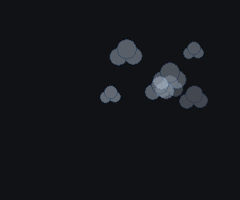

# Yes, Dev

A Windows tray app that clicks Chrome's **"Allow remote debugging?"** prompt for you.

Chrome 144+ asks for consent every single time a client attaches to the remote
debugging endpoint. If you drive Chrome with more than one agent or automation
client, those prompts stack up and each one blocks its client until a human
clicks Allow. `Yes, Dev` sits in the tray and answers them.

Measured on Chrome 151: four parallel attaches went from ~35 seconds of waiting
on a human to **2.4-4.4 seconds**, unattended.



*Each approval releases one cloud, which rises and fades. Shown here against a
plain backdrop; on a real desktop they drift over whatever is behind them.*

**Field data**, from the machine it was built on: 454 approvals over 8 days,
one failed click (99.8% success), no runaway pauses, and it came back by itself
after a reboot.

## Why not just turn the prompt off?

You can't. There's no flag, no policy, no "remember my choice". The
`RemoteDebuggingAllowed` enterprise policy only enables or disables the feature
outright, and the upstream requests to persist approval
([#825](https://github.com/ChromeDevTools/chrome-devtools-mcp/issues/825),
[#1794](https://github.com/ChromeDevTools/chrome-devtools-mcp/issues/1794)) are
still open. Clicking it is the only route.

## Read this before you install it

That prompt exists to stop a malicious local program from seizing your
signed-in browser: full access to your cookies, your saved data, and the ability
to navigate anywhere as you. Auto-approving means **any** local process that
attaches gets in, not just the ones you started.

On a single-user dev machine that's usually a fine trade. It is still a real
reduction in protection, so `Yes, Dev` ships with two mitigations on by default:

- **Stay on for** a fixed window (15 min / 1 hour / 4 hours), then it disarms itself.
- **Burst guard** reacts if approvals spike past 60 in a minute, which is well
  clear of normal load but far below a runaway loop. By default it asks what to
  do, with a visible five-second countdown: **Stop** or **Allow for one hour**.
  Letting the timer run out stops it, because that is the safe answer to a burst
  you were not expecting. Set it to **Stop silently** instead and it pauses
  without asking, re-arming a minute later. Turn the guard off entirely if your
  workload makes it noise.

The 60/min default is measured, not guessed: several agents working in parallel
peaked at 15 approvals in the busiest minute of a real session. Set your own
limit from the tray if your workload is heavier.

If you only need automation against a *throwaway* profile, you don't need this at
all: launch Chrome with its own `--user-data-dir` and it never prompts. This tool
is for when you need your real, signed-in browser.

## Install

Requires Windows and Python 3.9+.

```bash
pip install pystray pillow
```

Then clone this repo and start it:

```bash
pythonw yes_dev.pyw
```

Right-click the tray icon and tick **Start at login** to make it permanent (it
drops a shortcut in your Startup folder - no scheduled task, no admin rights).

## The menu

| Item | What it does |
|---|---|
| **On** | Master switch. Off means the engine isn't running at all. |
| **Start at login** | Adds/removes a Startup folder shortcut. |
| **Stay on for** | Auto-disarm after 15 min / 1 hour / 4 hours, or stay on until you say otherwise. |
| **Speed** | Poll interval: 150ms / 250ms / 750ms. |
| **Approve notice** | How approvals are announced: floating puffs (default), a toast card, or silent. |
| **Pause on burst** | Trip past 30 / 60 / 120 approvals a minute, or off. Then either **ask me first** (5s dialog: Stop, or Allow for one hour) or **stop silently** and re-arm after a minute. |
| **Observe only** | Log the dialogs but don't click - useful for a first look. |
| **Include Microsoft Edge** | Watch Edge windows too. |
| **Open log / Open config** | `%LOCALAPPDATA%\YesDev\` |

The icon is green when armed, amber when observing, grey when off, red when
paused. Its tooltip carries a running approval count.

## How it works

The interesting part is finding the dialog. It is **not** a top-level window -
it's a Views bubble parented inside the browser frame, so the obvious approach
of enumerating top-level windows never sees it:

```
Window  Chrome_WidgetWin_1   "<tab title> - Google Chrome"
  Pane    BrowserRootView
    Pane    Chrome_WidgetWin_1  "Allow remote debugging?"    <-- dialog host
      NonClientView > BubbleFrameView > DialogClientView > ButtonRowContainer
        Button  MdTextButton   "Allow" | "Cancel" | "Turn off in settings"
```

`watcher.ps1` walks exactly two levels down from each browser frame, matches the
host window by title, and invokes the Allow button via UI Automation's
`InvokePattern`. That means **no mouse movement and no focus stealing** - it
works on background windows while you keep typing somewhere else.

Three details that matter if you're reimplementing this:

- **Anchor the button match** to `^(allow|approve)$`. Web pages have their own
  "Allow" buttons (ad blockers, permission chips), and a loose match will click
  them. It also keeps you off "Turn off in settings", which disables the feature.
- **Scope the search to the dialog subtree**, not the whole window, for the same
  reason.
- **Skip `IsOffscreen` elements.** A torn-down bubble lingers in the automation
  tree for a moment and will otherwise be "approved" again.

The Python side never touches UI Automation. It supervises the engine process,
tails its log to drive the counter, notices, and burst guard, and writes
`config.json`. Options that the engine only reads at startup restart it
automatically.

### The puffs

A toast card per approval is worse than the problem when approvals fire dozens
of times an hour, so the default notice is a small translucent cloud that drifts
up from the tray and fades out. Position, size, rise speed, drift, lifetime and
release delay are all jittered, so a burst scatters instead of stacking. The
windows are layered, click-through and non-activating - they never take focus or
swallow a click. Warnings (burst guard, auto-disarm) still use a real toast,
because those carry text you need to read.


Every cloud is generated, never a stored asset: five jittered lobes over a flat
base, blurred for soft edges, put through a contrast curve so the silhouette
still reads as a shape, then shaded with a vertical gradient. No two are
identical. The art above came straight out of the running code -
`puffs._render_cloud(width, premultiply=False)` returns a straight-alpha PNG
suitable for documentation, while the app itself uses the premultiplied form.

The clouds are drawn as 32-bit bitmaps and handed to the compositor with
`UpdateLayeredWindow`, not painted by Tk. Colour-keyed transparency can only
make one exact colour disappear, which forces hard aliased edges; per-pixel
alpha gives soft edges and a shaded underside, and one call moves and fades a
cloud together.

Two Windows quirks cost real time here and are worth knowing if you touch
`puffs.py`:

- **Tk will not paint from a worker thread.** Toplevels created off the main
  thread are reported visible by `IsWindowVisible`, sit at the right
  coordinates, and render solid black. Identical code on the main thread paints
  fine. Since pystray owns the parent's main thread, the overlay runs as its own
  small process (`puffs.py --serve`) that takes one integer per line on stdin.
- **Order matters around `SetWindowLongW`.** Applying the click-through ex-style
  to a window that has not been realized yet drops its layered attributes and it
  stays invisible forever. Call `update_idletasks()` first, then set the style,
  then push the bitmap.
- **Declare argtypes, not just restype, for anything taking a handle.** With only
  a restype set, ctypes passes a Python int as a C int and a 64-bit `HDC`
  overflows it - `CreateDIBSection` fails with "argument 1: OverflowError: int
  too long to convert", the window never gets its pixels, and a plain white
  rectangle sits there instead of a cloud.
- **Never let a frame kill the animation loop.** An exception between `after()`
  calls stops the reschedule, and every cloud on screen freezes there
  permanently. Catch per-frame, destroy what is live, and keep the loop going.

Set `YESDEV_DEBUG=1` to have the overlay log spawns and failures to
`%LOCALAPPDATA%\YesDev\puffs.log`.

## Files

| Path | Role |
|---|---|
| `yes_dev.pyw` | Tray UI, engine supervisor, config |
| `watcher.ps1` | The UI Automation engine. Runs standalone too. |
| `puffs.py` | The cloud overlay. Runs as its own process. |
| `burst_dialog.py` | The five-second burst prompt. Also its own process. |
| `%LOCALAPPDATA%\YesDev\config.json` | Settings |
| `%LOCALAPPDATA%\YesDev\yes-dev.log` | Approvals, from the engine |
| `%LOCALAPPDATA%\YesDev	ray.log` | Tray-side events and errors |
| `docs/cloud.png`, `docs/clouds.png` | Cloud art on transparency, regenerable from `puffs.py` |

Both logs roll over at 1MB, keeping one previous generation.

Run the engine by itself if you'd rather not have a tray at all:

```bash
powershell -NoProfile -ExecutionPolicy Bypass -File watcher.ps1 -Observe
```

## Known limitations

- **English Chrome only.** The dialog is matched by its title, "Allow remote
  debugging?", and the button by its label. A localised Chrome uses translated
  strings and nothing will match. Both are parameters on `watcher.ps1`
  (`-DialogPattern`, `-ApprovePattern`), so a translated build needs only new
  patterns - but the tray does not expose them yet.
- **Matched by string, so a Chrome rename breaks it.** If a future Chrome
  retitles the dialog, approvals silently stop. The log still records dialogs it
  found but could not act on, so `-Observe` will tell you quickly.
- **Clouds anchor to the primary monitor** and are positioned in unscaled
  pixels. Tested on a single 1920x1080 display at 100% scale; on a scaled or
  multi-monitor setup they may land somewhere unhelpful. The approving itself is
  resolution-independent and unaffected.
- **Windows only**, by construction - it is built on UI Automation.

## License

MIT
