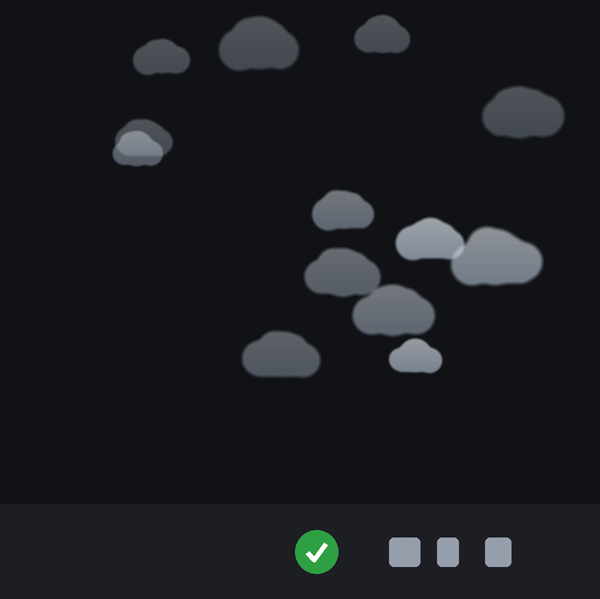
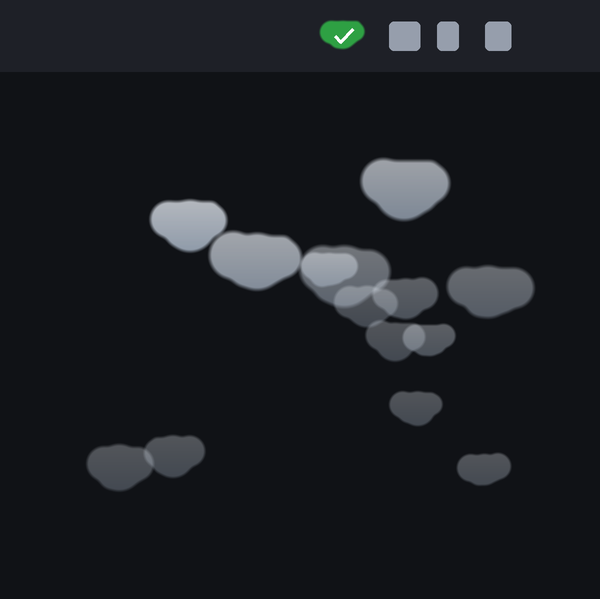

# Yes, Dev

A tray app that clicks Chrome's **"Allow remote debugging?"** prompt for you.
Windows and macOS.

Chrome 144+ asks for consent every single time a client attaches to the remote
debugging endpoint. If you drive Chrome with more than one agent or automation
client, those prompts stack up and each one blocks its client until a human
clicks Allow. `Yes, Dev` sits in the tray and answers them.

Measured on Chrome 151: four parallel attaches went from ~35 seconds of waiting
on a human to **2.4-4.4 seconds**, unattended.


*Each approval releases one cloud, which drifts away from the tray and fades.
Shown here against a plain backdrop; on a real desktop they drift over whatever
is behind them.*

**Field data**, from the machine it was built on: 454 approvals over 8 days,
one failed click (99.8% success), no runaway pauses, and it came back by itself
after a reboot. That figure is from the Windows build, which has the mileage;
the macOS build is newer and is described honestly under
[Known limitations](#known-limitations).

## Why not just turn the prompt off?

You can't, and this is not a gap waiting to be filled. There's no flag, no
policy, no "remember my choice". The `RemoteDebuggingAllowed` enterprise policy
only enables or disables the feature outright.

The request to persist approval,
[#825](https://github.com/ChromeDevTools/chrome-devtools-mcp/issues/825), was
**closed as not planned** in March 2026 - so a built-in "always allow" is not
coming. [#1794](https://github.com/ChromeDevTools/chrome-devtools-mcp/issues/1794),
about the prompts stacking up when several clients connect at once, is still
open. Clicking the button is the only route, which is what this does.

## Read this before you install it

That prompt exists to stop a malicious local program from seizing your
signed-in browser: full access to your cookies, your saved data, and the ability
to navigate anywhere as you. Auto-approving means **any** local process that
attaches gets in, not just the ones you started.

On a single-user dev machine that's usually a fine trade. It is still a real
reduction in protection, so `Yes, Dev` ships with two mitigations on by default:

- **Stay on for** a fixed window (15 min / 1 hour / 4 hours), then it disarms itself.
- **Burst guard** reacts if approvals spike past 60 in a minute, which is well
  clear of normal load but far below a runaway loop. By default it asks what to
  do, with a visible five-second countdown: **Stop** or **Allow for one hour**.
  Letting the timer run out stops it, because that is the safe answer to a burst
  you were not expecting. Set it to **Stop silently** instead and it pauses
  without asking, re-arming a minute later. Turn the guard off entirely if your
  workload makes it noise.

The 60/min default is measured, not guessed: several agents working in parallel
peaked at 15 approvals in the busiest minute of a real session. Set your own
limit from the tray if your workload is heavier.

Both mitigations live in the tray, not in the engine, so the tray dying must not
leave an engine approving prompts with nothing watching the rate. On macOS the
engine is passed `--exit-with-parent` and stops itself the moment it is
reparented; on both platforms the tray kills the engine on the way out.

If you only need automation against a *throwaway* profile, you don't need this at
all: launch Chrome with its own `--user-data-dir` and it never prompts. This tool
is for when you need your real, signed-in browser.

## Install

Clone the repo, then follow your platform.

### Windows

Requires Windows and Python 3.9+.

```bash
pip install pystray pillow
```

```bash
pythonw yes_dev.pyw
```

Right-click the tray icon and tick **Start at login** to make it permanent (it
drops a shortcut in your Startup folder - no scheduled task, no admin rights).

### macOS

Requires Python 3.9+. Use a python.org build, or a Homebrew one with Tk, since
the burst dialog is Tk. Built and verified on macOS 26 with Chrome 152; nothing
here is new API, but no older macOS has been tested.

```bash
pip install rumps pillow pyobjc-framework-Cocoa pyobjc-framework-ApplicationServices
```

```bash
python3 yes_dev_mac.py
```

Then **grant Accessibility**, which macOS requires before any process may drive
another app's UI. The menu's top section shows whether you have it; clicking
**Accessibility: NOT granted** raises the system prompt and opens
System Settings > Privacy & Security > Accessibility. Without it every attribute
read comes back empty and the app looks broken rather than unpermitted.

Run as a loose script, that grant attaches to your **Python binary** - fragile,
because it breaks when the interpreter path changes, and far too broad, because
everything that interpreter ever runs inherits it. A signed `.app` bundle is the
right home for it and is not built yet; see
[Known limitations](#known-limitations).

### Getting Chrome to prompt at all

From Chrome 136, `--remote-debugging-port` is **ignored on your default profile**
unless it is paired with a non-default `--user-data-dir` - and a throwaway
profile never prompts, so it is not the thing to test against. To attach to your
real, signed-in browser, turn on **Remote Debugging** at
`chrome://inspect/#remote-debugging`. Each attach to the browser endpoint then
raises the consent prompt, which is what this app answers. The consent gates the
CDP WebSocket handshake itself, so a blocked client sits waiting mid-handshake.

## The menu

| Item | What it does |
|---|---|
| **On** | Master switch. Off means the engine isn't running at all. |
| **Accessibility** *(macOS)* | Whether the permission is granted; click to request it and open the settings pane. |
| **Start at login** | Windows: a Startup folder shortcut. macOS: a LaunchAgent. |
| **Stay on for** | Auto-disarm after 15 min / 1 hour / 4 hours, or stay on until you say otherwise. |
| **Speed** | Poll interval: 150ms / 250ms / 750ms. |
| **Approve notice** | How approvals are announced: floating puffs (default), a toast card, or silent. |
| **Pause on burst** | Trip past 30 / 60 / 120 approvals a minute, or off. Then either **ask me first** (5s dialog: Stop, or Allow for one hour) or **stop silently** and re-arm after a minute. |
| **Observe only** | Log the dialogs but don't click - useful for a first look. |
| **Include Microsoft Edge** | Watch Edge windows too. |
| **Open log / Open config** | The data directory for your platform (see [Files](#files)). |

The icon is green when armed, amber when observing, grey when off, red when
paused, and carries a running approval count - in the tooltip on Windows, in the
menu on macOS.

## How it works

Three processes on both platforms, and the seams between them are plain text,
which is why a second platform could be dropped in without touching the shared
logic:

```
tray            owns config, the menu, the counter and the burst guard
  |
  +-- engine    finds and clicks the dialog
  |             appends "[ACTION]" lines to yes-dev.log  <-- the tray tails this
  |
  +-- overlay   the clouds; one integer per line on stdin = show N clouds
  |
  +-- burst_dialog.py   the 5s prompt; prints its answer on stdout
```

The engine's entire interface to the tray is that log line, so the counter, the
clouds and the burst guard work unchanged whichever engine is running. The tray
never touches the accessibility APIs itself: it supervises the engine process,
tails its log, and writes `config.json`. Options the engine only reads at
startup restart it automatically.

The **config file is identical on both platforms** - same name, same keys, same
defaults - so settings copy across machines. Both builds read it as `utf-8-sig`
and write plain UTF-8, because Notepad and PowerShell add a byte-order mark that
a strict UTF-8 read would reject, silently resetting every setting to default.

### Finding the dialog on Windows

The interesting part is finding the dialog. It is **not** a top-level window -
it's a Views bubble parented inside the browser frame, so the obvious approach
of enumerating top-level windows never sees it:

```
Window  Chrome_WidgetWin_1   "<tab title> - Google Chrome"
  Pane    BrowserRootView
    Pane    Chrome_WidgetWin_1  "Allow remote debugging?"    <-- dialog host
      NonClientView > BubbleFrameView > DialogClientView > ButtonRowContainer
        Button  MdTextButton   "Allow" | "Cancel" | "Turn off in settings"
```

`watcher.ps1` walks exactly two levels down from each browser frame, matches the
host window by title, and invokes the Allow button via UI Automation's
`InvokePattern`. That means **no mouse movement and no focus stealing** - it
works on background windows while you keep typing somewhere else.

### Finding the dialog on macOS

Same shape of problem, different tree. Here the dialog *is* attached to the
browser window, as an `AXSheet`, wrapping an alert whose subrole is the thing
worth matching on:

```
AXApplication  "Chrome"
  AXWindow  "<tab title> - Google Chrome"
    AXSheet  "Allow remote debugging?"                    <-- dialog host
      AXGroup / AXSubrole=AXApplicationAlertDialog
        AXButton  "Turn off in settings" | "Cancel" | "Allow"
```

`watcher_mac.py` walks each Chrome process's windows, sheets and children,
matches by title *and* role, and presses the button with `AXPress` - again with
no mouse movement and no focus stealing.

Two macOS-specific traps, both found by running `docs/mac/ax_probe.py` against a
live prompt:

- **The title alone is not enough.** It also matches the Window menu's
  `AXMenuItem` for the dialog, and an `AXHeading` inside it. Matching role as
  well as title is what separates the real dialog from its echoes.
- **There is no `GetRuntimeId()`.** Chrome sets no `AXIdentifier` on this alert,
  so deduplication keys on position and size instead. Note that `AXPosition`
  comes back as an `AXValue` and must be unwrapped with `AXValueGetValue` -
  pyobjc has no `.pointValue()`, and a key that silently falls back to object
  identity changes on every sweep, which defeats the dedupe entirely.

macOS also demands an **Accessibility grant** that has no Windows equivalent.
This is TCC, it is deliberate, and it cannot be scripted around: AppleScript and
System Events need exactly the same grant, so there is no side door.

### The puffs

A toast card per approval is worse than the problem when approvals fire dozens
of times an hour, so the default notice is a small translucent cloud that drifts
away from the tray and fades out. Position, size, speed, drift, lifetime and
release delay are all jittered, so a burst scatters instead of stacking. The
windows are click-through and non-activating - they never take focus or swallow
a click. Warnings (burst guard, auto-disarm) still use a real toast, because
those carry text you need to read.

| Windows | macOS |
|---|---|
|  |  |
| *__Windows.__ The tray sits at the bottom of the screen, so a cloud is released there and **rises** away into open desktop.* | *__macOS.__ The status item sits at the top, so a cloud is released just under the menu bar and **falls** away from it - and hangs, flipped, rather than sitting on its flat base.* |

That direction is the one deliberate behavioural difference between the two
builds, and it is forced rather than chosen. Rising was tried first on macOS and
measured: released level with the status item, a cloud crossed the menu bar
within a second and spent the rest of its life off-screen, still ~40% opaque.

Every cloud is generated, never a stored asset: five jittered lobes over a flat
base, blurred for soft edges, put through a contrast curve so the silhouette
still reads as a shape, then shaded with a vertical gradient. No two are alike.
The macOS overlay flips only the **alpha mask**, not the whole image - flipping
the image carries the shading with it and lights the cloud from below, which
looks wrong hanging under a menu bar.

Neither picture is a mock-up or a hand-arranged row. `docs/make_art.py` and
`docs/make_art_mac.py` replay a real burst and freeze it mid-flight, taking the
shapes, spawn positions, speed, drift and fade straight from `puffs.py` and
`puffs_mac.py`, so the art cannot drift from the app. They are shown on a dark
ground because the clouds are built to read over a taskbar and would be nearly
invisible on a white page; `docs/clouds.png` and `docs/clouds-mac.png` are the
same images with transparent backgrounds, and `docs/cloud.png` is a single
cloud, for reuse elsewhere.

The macOS status icon is drawn from the same renderer, so the icon and the
notification are literally the same shape rather than two things that merely
resemble each other.

#### Windows: layered windows

The clouds are drawn as 32-bit bitmaps and handed to the compositor with
`UpdateLayeredWindow`, not painted by Tk. Colour-keyed transparency can only
make one exact colour disappear, which forces hard aliased edges; per-pixel
alpha gives soft edges and a shaded underside, and one call moves and fades a
cloud together.

Three Windows quirks cost real time here and are worth knowing if you touch
`puffs.py`:

- **Tk will not paint from a worker thread.** Toplevels created off the main
  thread are reported visible by `IsWindowVisible`, sit at the right
  coordinates, and render solid black. Identical code on the main thread paints
  fine. Since pystray owns the parent's main thread, the overlay runs as its own
  small process (`puffs.py --serve`) that takes one integer per line on stdin.
- **Order matters around `SetWindowLongW`.** Applying the click-through ex-style
  to a window that has not been realized yet drops its layered attributes and it
  stays invisible forever. Call `update_idletasks()` first, then set the style,
  then push the bitmap.
- **Declare argtypes, not just restype, for anything taking a handle.** With only
  a restype set, ctypes passes a Python int as a C int and a 64-bit `HDC`
  overflows it - `CreateDIBSection` fails with "argument 1: OverflowError: int
  too long to convert", the window never gets its pixels, and a plain white
  rectangle sits there instead of a cloud.

#### macOS: transparent NSWindows

Easier than Windows, because per-pixel alpha is native: a borderless `NSWindow`
with `setOpaque_(False)`, a clear background, `setIgnoresMouseEvents_(True)` for
click-through, `NSStatusWindowLevel` so it floats above ordinary windows, and
`orderFrontRegardless()` to show without stealing focus. `setAlphaValue_` does
the fade and `setFrameOrigin_` the drift. No colour key, no premultiplication,
no layered-window ordering trap - the premultiplied path in `_render_cloud`
exists only for `UpdateLayeredWindow`, and macOS wants straight alpha.

Three things to get right:

- **Coordinates are flipped.** The macOS origin is bottom-left. Falling is `-y`
  here; rising on Windows is *also* `-y`. Same sign, opposite direction.
- **Use `NSScreen.visibleFrame`**, not `frame`, so the menu bar and Dock are
  excluded. It is the counterpart of `SPI_GETWORKAREA`.
- **Render at `backingScaleFactor` and size the image in points**, or the art is
  an upscaled 1x asset on a retina display.

On both platforms: **never let a frame kill the animation loop.** An exception
between scheduled callbacks stops the reschedule, and every cloud on screen
freezes there permanently, in the user's face. Catch per-frame, destroy what is
live, and keep the loop going.

Set `YESDEV_DEBUG=1` to have the overlay log spawns and failures to `puffs.log`
in the data directory.

## Files

| Path | Role |
|---|---|
| `yes_dev.pyw` | Windows tray UI, engine supervisor, config |
| `yes_dev_mac.py` | macOS menu-bar UI, engine supervisor, config |
| `watcher.ps1` | The UI Automation engine. Runs standalone too. |
| `watcher_mac.py` | The Accessibility engine. Runs standalone too. |
| `platform_mac.py` | macOS paths, single instance, permission check, autostart |
| `puffs.py` | The cloud overlay and the shared artwork. Its own process. |
| `puffs_mac.py` | The macOS cloud overlay. Its own process. |
| `burst_dialog.py` | The five-second burst prompt. Also its own process. Shared. |
| `docs/mac/ax_probe.py` | Dumps Chrome's accessibility tree around the dialog |
| `docs/make_art.py`, `docs/make_art_mac.py` | Regenerate the cloud art from `puffs.py` |

Everything the app writes lives in one directory per platform:

| | Windows | macOS |
|---|---|---|
| Data directory | `%LOCALAPPDATA%\YesDev\` | `~/Library/Application Support/YesDev/` |
| Settings | `config.json` | `config.json` |
| Approvals, from the engine | `yes-dev.log` | `yes-dev.log` |
| Tray-side events and errors | `tray.log` | `tray.log` |

Both logs roll over at 1MB, keeping one previous generation.

Run an engine by itself if you'd rather not have a tray at all:

```bash
powershell -NoProfile -ExecutionPolicy Bypass -File watcher.ps1 -Observe
```

```bash
python3 watcher_mac.py --observe
```

## Known limitations

- **English Chrome only.** The dialog is matched by its title, "Allow remote
  debugging?", and the button by its label. A localised Chrome uses translated
  strings and nothing will match. Both are parameters on `watcher.ps1`
  (`-DialogPattern`, `-ApprovePattern`); `watcher_mac.py` has the equivalent
  patterns as module constants. Neither tray exposes them yet.
- **Matched by string, so a Chrome rename breaks it.** If a future Chrome
  retitles the dialog, approvals silently stop. The log still records dialogs it
  found but could not act on, so observe mode will tell you quickly.
- **Clouds anchor to one screen.** On Windows they use the primary monitor in
  unscaled pixels, tested on a single 1920x1080 display at 100% scale. On macOS
  they anchor to the screen carrying the menu bar. Either way the approving
  itself is resolution-independent and unaffected.

### macOS specifically

- **Not packaged or signed yet.** Running as a loose script means the
  Accessibility grant attaches to your Python interpreter rather than to this
  app: fragile, and far broader than it should be. A signed `.app` is the fix
  and is the main piece of work outstanding.
- **Toast notices degrade to log-only.** Notification Center refuses
  notifications from an unbundled script, so `Approve notice > Toast card`
  writes to `tray.log` instead. Floating puffs, the default, are unaffected.
- **Autostart works but is untested across a real logout.** The LaunchAgent is
  written and loaded correctly; surviving an actual logout and login has not
  been proven the way it was on Windows.
- **Less mileage.** The Windows build has 454 real approvals behind it. The
  macOS build has been verified end to end against live prompts - engine, tray,
  overlay, teardown - but it has not yet run for days on end.

## License

MIT
