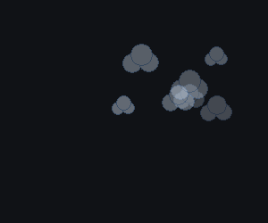
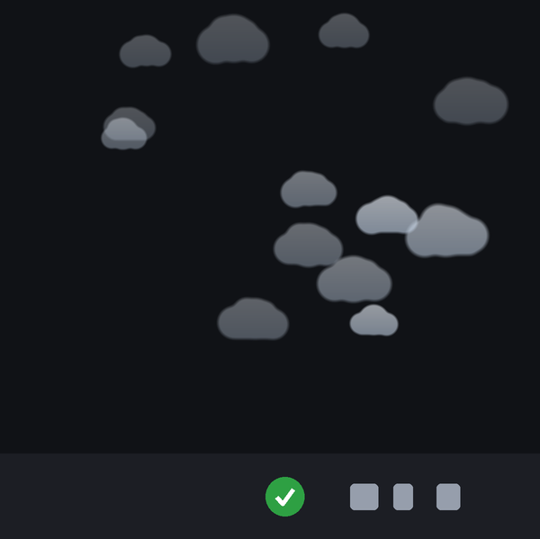
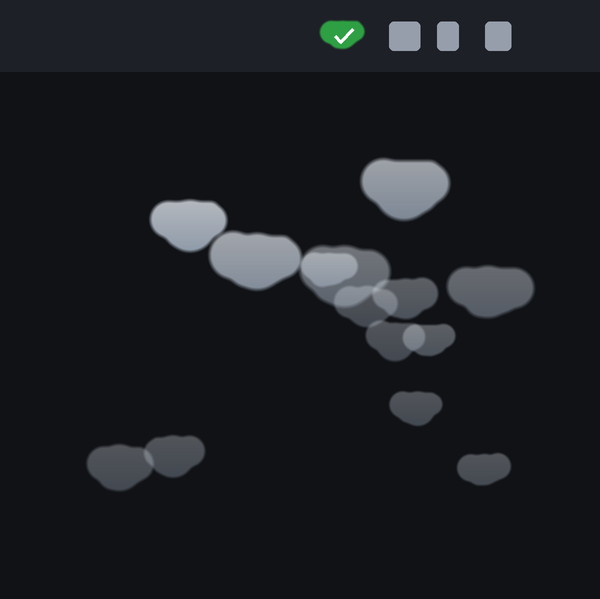

<p align="center">
  
</p>

<p align="center">
  A tray app that clicks Chrome's <b>"Allow remote debugging?"</b> prompt for you. Windows and macOS.
</p>

Chrome 144+ asks for consent every single time a client attaches to the remote
debugging endpoint. If you drive Chrome with more than one agent or automation
client, those prompts stack up and each one blocks its client until a human
clicks Allow. `Yes, Dev` sits in the tray and answers them.

**Latest release: [v1.2.2 - macOS on Chrome 153 and 154](https://github.com/dev-newb/yes-dev/releases/tag/v1.2.2).**
[Download the source ZIP](https://github.com/dev-newb/yes-dev/archive/refs/tags/v1.2.2.zip)
and follow the [Windows](#windows) or [macOS](#macos) install steps. This is a
Python source release, not a standalone installer.

This release carries the macOS work from
[#4](https://github.com/dev-newb/yes-dev/pull/4) and
[#6](https://github.com/dev-newb/yes-dev/pull/6): Chrome 153's untitled consent
sheet, the press-age guard that Chrome 154 needs, and a keyboard fallback that
never posts at a sheet that has already gone. It contains everything in v1.2.1,
which fixed Chrome/Edge process detection, English and Simplified Chinese consent
dialogs, the native Windows fallback, and approval counting and logging; see the
[test report and memory measurements](docs/testing/windows-validation-2026-09-30.md).

Measured on Chrome 151: four parallel attaches went from ~35 seconds of waiting
on a human to **2.4-4.4 seconds**, unattended.



*Each approval releases one cloud, which drifts away from the tray and fades.
Shown here against a plain backdrop; on a real desktop they drift over whatever
is behind them.*

**Earlier Windows field data**, from the machine it was built on: 454 approvals over 8 days,
one failed click (99.8% success), no runaway pauses, and it came back by itself
after a reboot. That figure is from the Windows build, which has the mileage;
the macOS build is newer and is described honestly under
[Known limitations](#known-limitations). These are historical measurements;
the v1.2.1 validation is linked above.

> ### Windows: update if you are running 1.0.0
>
> The 1.0.0 engine leaked memory, and badly. It walked the UI Automation tree
> four times a second whether or not a prompt was there, and those elements hold
> **native** memory that puts no pressure on the managed heap - so .NET never
> collected, and nothing was ever released. Measured at ~9 MB/min, about 13 GB a
> day. It was found in the field at **51.5 GB** private after ten days, with
> Windows compressing 11.8 GB to cope.
>
> The same build also let the engine outlive its tray. The burst guard and the
> disarm timer both live in the tray, so an orphaned engine keeps approving
> prompts with nothing watching the rate - the 51.5 GB one had been running
> unattended for five days.
>
> Both were fixed in **1.1.0**. Install the current
> **[v1.2.1 release](https://github.com/dev-newb/yes-dev/releases/tag/v1.2.1)**
> to get those repairs and the new Windows fixes. See [updating on Windows](#updating-on-windows)
> and the [changelog](CHANGELOG.md).

## Why not just turn the prompt off?

You can't, and this is not a gap waiting to be filled. There's no flag, no
policy, no "remember my choice". The `RemoteDebuggingAllowed` enterprise policy
only enables or disables the feature outright.

The request to persist approval,
[#825](https://github.com/ChromeDevTools/chrome-devtools-mcp/issues/825), was
**closed as not planned** in March 2026 - so a built-in "always allow" is not
coming. [#1794](https://github.com/ChromeDevTools/chrome-devtools-mcp/issues/1794),
about the prompts stacking up when several clients connect at once, is still
open. Clicking the button is the only route, which is what this does.

## Read this before you install it

That prompt exists to stop a malicious local program from seizing your
signed-in browser: full access to your cookies, your saved data, and the ability
to navigate anywhere as you. Auto-approving means **any** local process that
attaches gets in, not just the ones you started.

On a single-user dev machine that's usually a fine trade. It is still a real
reduction in protection, so `Yes, Dev` provides two controls:

- **Stay on for** a fixed window (15 min / 1 hour / 4 hours), then it disarms itself.
  On Windows, the default is **Until I turn it off**; select a time limit if you
  want automatic disarming.
- **Burst guard** reacts if approvals spike past 60 in a minute, which is well
  clear of normal load but far below a runaway loop. By default it asks what to
  do, with a visible five-second countdown: **Stop** or **Allow for one hour**.
  Letting the timer run out stops it, because that is the safe answer to a burst
  you were not expecting. Set it to **Stop silently** instead and it pauses
  without asking, re-arming a minute later. Turn the guard off entirely if your
  workload makes it noise.

The 60/min default is measured, not guessed: several agents working in parallel
peaked at 15 approvals in the busiest minute of a real session. Set your own
limit from the tray if your workload is heavier.

Both mitigations live in the tray, not in the engine, so the tray dying must not
leave an engine approving prompts with nothing watching the rate. On macOS the
engine is passed `--exit-with-parent` and stops itself the moment it is
reparented; on both platforms the tray kills the engine on the way out.

If you use command-line remote debugging with a separate `--user-data-dir`,
that direct connection mode does not use this consent prompt. Yes, Dev is for
the per-connection approval mode enabled through `chrome://inspect`. A fresh
profile can also use approval mode, as the isolated tests do.

## Install

Download the [v1.2.2 source ZIP](https://github.com/dev-newb/yes-dev/archive/refs/tags/v1.2.2.zip)
and extract it, or clone the current repository:

```bash
git clone https://github.com/dev-newb/yes-dev.git
cd yes-dev
```

Then follow your platform. `requirements.txt` covers both -
its markers install only what your platform needs, so `pip install -r
requirements.txt` works either place.

### Windows

Requires Windows, Python 3.9+, and Windows PowerShell 5.1. Run these commands
from the extracted or cloned project folder.

```bash
python -m pip install -r requirements.txt
```

```bash
pythonw yes_dev.pyw
```

Right-click the tray icon and tick **Start at login** to make it permanent (it
drops a shortcut in your Startup folder - no scheduled task, no admin rights).

### Updating on Windows

Exit Yes, Dev from its tray menu before replacing its files. For a Git checkout
on `main`, run `git pull --ff-only` in the project folder. If you installed from
a ZIP, replace the old source files with the extracted v1.2.1 files.

Run `python -m pip install -r requirements.txt`, then start `pythonw yes_dev.pyw`
again. The configuration stays in `%LOCALAPPDATA%\YesDev\config.json`. If you
move the project to a different folder, turn **Start at login** off and then on
again so its shortcut points to the new location.

### macOS

Requires Python 3.9+. Use a python.org build, or a Homebrew one with Tk, since
the burst dialog is Tk. Built and verified on macOS 26 against live prompts on
Chrome 152, 153 and 154; nothing here is new API, but no older macOS has been
tested.

```bash
pip install -r requirements.txt
```

That pulls in `rumps`, `pillow` and the pyobjc frameworks the engine needs:
Cocoa, ApplicationServices and Quartz. Quartz is not optional - it carries the
keyboard fallback described under
[Finding the dialog on macOS](#finding-the-dialog-on-macos), and the engine
refuses to start without it.

```bash
python3 yes_dev_mac.py
```

Then **grant Accessibility**, which macOS requires before any process may drive
another app's UI. The menu's top section shows whether you have it; clicking
**Accessibility: NOT granted** raises the system prompt and opens
System Settings > Privacy & Security > Accessibility. Without it every attribute
read comes back empty and the app looks broken rather than unpermitted.

Run as a loose script, that grant attaches to your **Python binary** - fragile,
because it breaks when the interpreter path changes, and far too broad, because
everything that interpreter ever runs inherits it. A signed `.app` bundle is the
right home for it and is not built yet; see
[Known limitations](#known-limitations).

### Getting Chrome to prompt at all

[Chrome 136 changed the command-line debugging switches](https://developer.chrome.com/blog/remote-debugging-port):
`--remote-debugging-port` and `--remote-debugging-pipe` require a non-default
`--user-data-dir`. That direct mode differs from per-connection approval mode.

For the consent flow that Yes, Dev handles, turn on **Remote Debugging** at
`chrome://inspect/#remote-debugging`. Each new connection then requires the
consent prompt. This also works in a fresh profile; the isolated browser tests
use fresh profiles with approval mode enabled. The prompt gates the CDP
WebSocket handshake, so the connection waits until approval.

## The menu

| Item | What it does |
|---|---|
| **On** | Master switch. Off means the engine isn't running at all. |
| **Accessibility** *(macOS)* | Whether the permission is granted; click to request it and open the settings pane. |
| **Start at login** | Windows: a Startup folder shortcut. macOS: a LaunchAgent. |
| **Stay on for** | Auto-disarm after 15 min / 1 hour / 4 hours, or stay on until you say otherwise. |
| **Speed** | Poll interval: 150ms / 250ms / 750ms. |
| **Approve notice** | How approvals are announced: floating puffs (default), a toast card, or silent. |
| **Pause on burst** | Trip past 30 / 60 / 120 approvals a minute, or off. Then either **ask me first** (5s dialog: Stop, or Allow for one hour) or **stop silently** and re-arm after a minute. |
| **Observe only** | Log the dialogs but don't click - useful for a first look. |
| **Include Microsoft Edge** | Watch Edge windows too. |
| **Settings…** *(macOS)* | A native window for approval, notifications, timing, login, diagnostic logging, and focus settings. Save applies validated changes; Cancel discards edits. |
| **Focus behavior** *(macOS Settings → Focus & connection)* | Off, Quiet focus, or Fast focus through the local relay. Off by default; see below. |
| **Open log / Open relay log** *(macOS)* | Approval and connection diagnostics. |
| **Open log / Open config** *(Windows)* | The data directory for your platform (see [Files](#files)). |

On macOS, the configuration controls in this table live in **Settings…**;
the menu keeps the master switch, status, Accessibility, logs, and Quit. No JSON
editing is needed. Settings are still stored internally in `config.json`.

### Fast focus through the local relay (macOS, experimental)

In **Settings… → Focus & connection**, choose **Fast focus via local relay**,
select Chrome's data folder, and Save. The data folder contains `Local State`
and `DevToolsActivePort` (normally `~/Library/Application Support/Google/Chrome`),
rather than its `Default` or `Profile 1` subfolder. Enable Remote Debugging in
Chrome at `chrome://inspect/#remote-debugging`.

Use the saved connection address shown in Settings, normally
`http://127.0.0.1:9333`, for the client's browser URL. For example, Playwright's
Python API connects with:

```python
browser = await playwright.chromium.connect_over_cdp("http://127.0.0.1:9333")
```

Clients that accept a browser websocket can use
`ws://127.0.0.1:9333/devtools/browser/yesdev`. HTTP discovery at `/json/version`
returns this address without opening a connection to Chrome. The relay binds
only to loopback and rejects website Origin headers and unrelated Host headers.

Each client gets its own upstream Chrome socket, so normal CDP messages and
session IDs remain independent. Only handshakes are queued: the focus guard
acknowledges a short-lived request immediately before the relay opens Chrome's
socket. Existing clients then continue concurrently. Disconnects close their
upstream socket; a later connection rereads Chrome's endpoint after a restart.

Fast focus applies to connections through this relay. Direct Chrome connections
still work, but do not get a focus restore while Fast focus is selected. The
normal guard and fast guard are mutually exclusive to avoid competing restores.
Turning approvals off, choosing Observe only, or pausing the app stops the relay
and disconnects its clients. The relay resumes with approval; clients reconnect.

This is an experimental shortcut based on request timing, not proof that a
particular activation belongs to a consent sheet. Input after arming cancels the
restore; recent input permits the connection without returning focus. It still
creates one consent prompt per client connection. The persistent, multiplexed
proxy in `docs/planning/cdp-proxy.md` is separate work.

The icon is green when armed, amber when observing, grey when off, red when
paused, and carries a running approval count - in the tooltip on Windows, in the
menu on macOS.

## How it works

Three processes on both platforms, and the seams between them are plain text,
which is why a second platform could be dropped in without touching the shared
logic:

```
tray            owns config, the menu, the counter and the burst guard
  |
  +-- engine    finds and clicks the dialog
  |             appends "[ACTION]" lines to yes-dev.log  <-- the tray tails this
  |
  +-- overlay   the clouds; one integer per line on stdin = show N clouds
  |
  +-- burst_dialog.py   the 5s prompt; prints its answer on stdout
```

The engine's entire interface to the tray is that log line, so the counter, the
clouds and the burst guard work unchanged whichever engine is running. The tray
never touches the accessibility APIs itself: it supervises the engine process,
tails its log, and writes `config.json`. Options the engine only reads at
startup restart it automatically.

The common approval settings use the same keys and defaults on both platforms.
macOS adds focus and relay settings. Both builds read `utf-8-sig` and write plain
UTF-8 so files copied from Windows can include a byte-order mark. The macOS
settings window validates changes and replaces the saved file atomically;
unrecognized settings are preserved.

### Finding the dialog on Windows

`watcher.ps1` first enumerates visible top-level `Chrome_WidgetWin_1` windows.
It matches the consent title and browser process before it reads any UI
Automation elements. The idle path does not scan the browser's accessibility tree.

The engine invokes the matching Allow button through `InvokePattern`. If that
fails, it uses the native `LegacyIAccessible` COM interface for the same button
runtime ID inside the same dialog. Neither method moves the mouse or changes focus.

An action call is logged as an attempt. The engine writes one `[ACTION]` event
only after the original dialog/button disappears. A pending entry holds only
the window handle, process ID, button runtime ID and method name, not live UI
Automation objects. Repeated attempts on one prompt do not increase the tray
counter or burst rate. A new button identity can be handled immediately even if
Windows reused the window handle.

The counter measures dialog dismissal after an approval action. It cannot inspect
another client's protocol session. The isolated browser tests verify successful
CDP connections separately, and require one counter event per tested connection.

The log writer permits concurrent reading and uses bounded retries for short
file locks. A confirmation stays pending until its ACTION record is saved. A
reader that blocks log rotation does not cause the current event to be dropped;
the engine appends it and retries rotation on a later write.

### Finding the dialog on macOS

Same shape of problem, different tree. Here the dialog *is* attached to the
browser window, as an `AXSheet`, wrapping an alert whose subrole is the thing
worth matching on:

```
AXApplication  "Chrome"
  AXWindow  "<tab title> - Google Chrome"
    AXSheet  "Allow remote debugging?"                    <-- dialog host
      AXGroup / AXSubrole=AXApplicationAlertDialog
        AXButton  "Turn off in settings" | "Cancel" | "Allow"
```

That is the shape on Chrome 152 and 154. Chrome 153 leaves the sheet's own
title empty and puts the same string on an `AXHeading` inside it, so an untitled
sheet whose heading matches counts as the host too. The heading walk is shallow
and runs only for untitled dialogs, so the idle scan still costs well under a
millisecond per Chrome process.

`watcher_mac.py` walks each Chrome process's windows, sheets and children,
matches by title (or heading) *and* role, and presses the button with
`AXPress` - with no mouse movement, and without activating Chrome.

It does not press straight away. Chromium discards input for half a second
after a security-sensitive dialog appears, and on Chrome 154 that includes
`AXPress`: a press inside that window returns success and does nothing. So a
sheet is pressed only once it has stood for that guard, measured from the sweep
that first saw it. That costs at most one poll plus the guard in latency and
makes the first press land. Measured on 154 with three clients queued: before
the guard, every first press was swallowed and every approval needed a second
sweep; after it, one press per sheet.

An approval is logged only once the sheet is verified gone, and "gone" is judged
by the AX references that were pressed, never by what now sits at those
coordinates - Chrome draws the next queued prompt exactly where the last one was,
so a geometry check would call a dismissed sheet still up and miss a real
approval.

If the sheet still stands after the press, the engine falls back to the
keyboard: it writes `AXFocused` onto the Allow button and posts a Space
keystroke to Chrome's process with `CGEventPostToPid`, which delivers keyboard
events without moving the pointer. Every keystroke is gated on the pressed sheet
still being the same live node, re-read before the focus write and immediately
before Space, so a key is never posted at a sheet that has already gone. This
path only works with **Keyboard navigation** on (System Settings > Keyboard);
with it off, Chrome declines the focus write and Tab cannot reach the button, so
the engine sends nothing and simply retries next sweep. There is still no
synthetic mouse click anywhere in the engine. A sheet that outlives both routes
is logged FAILED and pressed again next sweep.

Two macOS-specific traps, both found by running `docs/mac/ax_probe.py` against a
live prompt:

- **The title alone is not enough.** It also matches the Window menu's
  `AXMenuItem` for the dialog, and an `AXHeading` inside it. Matching role as
  well as title is what separates the real dialog from its echoes.
- **There is no `GetRuntimeId()`.** Chrome sets no `AXIdentifier` on this alert,
  so deduplication keys on position and size instead. Note that `AXPosition`
  comes back as an `AXValue` and must be unwrapped with `AXValueGetValue` -
  pyobjc has no `.pointValue()`, and a key that silently falls back to object
  identity changes on every sweep, which defeats the dedupe entirely.

macOS also demands an **Accessibility grant** that has no Windows equivalent.
This is TCC, it is deliberate, and it cannot be scripted around: AppleScript and
System Events need exactly the same grant, so there is no side door.

### The puffs

A toast card per approval is worse than the problem when approvals fire dozens
of times an hour, so the default notice is a small translucent cloud that drifts
away from the tray and fades out. Position, size, speed, drift, lifetime and
release delay are all jittered, so a burst scatters instead of stacking. The
windows are click-through and non-activating - they never take focus or swallow
a click. Warnings (burst guard, auto-disarm) still use a real toast, because
those carry text you need to read.

| Windows | macOS |
|---|---|
|  |  |
| *__Windows.__ The tray sits at the bottom of the screen, so a cloud is released there and **rises** away into open desktop.* | *__macOS.__ The status item sits at the top, so a cloud is released just under the menu bar and **falls** away from it - and hangs, flipped, rather than sitting on its flat base.* |

That direction is the one deliberate behavioural difference between the two
builds, and it is forced rather than chosen. Rising was tried first on macOS and
measured: released level with the status item, a cloud crossed the menu bar
within a second and spent the rest of its life off-screen, still ~40% opaque.

Every cloud is generated, never a stored asset: five jittered lobes over a flat
base, blurred for soft edges, put through a contrast curve so the silhouette
still reads as a shape, then shaded with a vertical gradient. No two are alike.
The macOS overlay flips only the **alpha mask**, not the whole image - flipping
the image carries the shading with it and lights the cloud from below, which
looks wrong hanging under a menu bar.

Neither picture is a mock-up or a hand-arranged row. `docs/make_art.py` and
`docs/make_art_mac.py` replay a real burst and freeze it mid-flight, taking the
shapes, spawn positions, speed, drift and fade straight from `puffs.py` and
`puffs_mac.py`, so the art cannot drift from the app. The two generators are
built the same way and to the same size, so the pair sits level and any
difference you see between them is a real difference in the app rather than an
artefact of how the picture was made.

The bar along the edge of each - taskbar below, menu bar above - is a
genericized stand-in, but the app's own icon on it is the real one, drawn from
the same code the app uses: a green circle with a check in the Windows tray, and
on macOS the cloud itself, flipped and filled, so the icon and the notification
are literally the same shape rather than two things that merely resemble each
other. The neighbouring icons are placeholders, there for scale.

Both are shown on a dark ground because the clouds are built to read over a
taskbar and would be nearly invisible on a white page. `docs/clouds.png` and
`docs/clouds-mac.png` are the same frames with transparent backgrounds and no
bar, and `docs/cloud.png` is a single cloud, for reuse elsewhere.

#### Windows: layered windows

The clouds are drawn as 32-bit bitmaps and handed to the compositor with
`UpdateLayeredWindow`, not painted by Tk. Colour-keyed transparency can only
make one exact colour disappear, which forces hard aliased edges; per-pixel
alpha gives soft edges and a shaded underside, and one call moves and fades a
cloud together.

Three Windows quirks cost real time here and are worth knowing if you touch
`puffs.py`:

- **Tk will not paint from a worker thread.** Toplevels created off the main
  thread are reported visible by `IsWindowVisible`, sit at the right
  coordinates, and render solid black. Identical code on the main thread paints
  fine. Since pystray owns the parent's main thread, the overlay runs as its own
  small process (`puffs.py --serve`) that takes one integer per line on stdin.
- **Order matters around `SetWindowLongW`.** Applying the click-through ex-style
  to a window that has not been realized yet drops its layered attributes and it
  stays invisible forever. Call `update_idletasks()` first, then set the style,
  then push the bitmap.
- **Declare argtypes, not just restype, for anything taking a handle.** With only
  a restype set, ctypes passes a Python int as a C int and a 64-bit `HDC`
  overflows it - `CreateDIBSection` fails with "argument 1: OverflowError: int
  too long to convert", the window never gets its pixels, and a plain white
  rectangle sits there instead of a cloud.

#### macOS: transparent NSWindows

Easier than Windows, because per-pixel alpha is native: a borderless `NSWindow`
with `setOpaque_(False)`, a clear background, `setIgnoresMouseEvents_(True)` for
click-through, `NSStatusWindowLevel` so it floats above ordinary windows, and
`orderFrontRegardless()` to show without stealing focus. `setAlphaValue_` does
the fade and `setFrameOrigin_` the drift. No colour key, no premultiplication,
no layered-window ordering trap - the premultiplied path in `_render_cloud`
exists only for `UpdateLayeredWindow`, and macOS wants straight alpha.

Three things to get right:

- **Coordinates are flipped.** The macOS origin is bottom-left. Falling is `-y`
  here; rising on Windows is *also* `-y`. Same sign, opposite direction.
- **Use `NSScreen.visibleFrame`**, not `frame`, so the menu bar and Dock are
  excluded. It is the counterpart of `SPI_GETWORKAREA`.
- **Render at `backingScaleFactor` and size the image in points**, or the art is
  an upscaled 1x asset on a retina display.

On both platforms: **never let a frame kill the animation loop.** An exception
between scheduled callbacks stops the reschedule, and every cloud on screen
freezes there permanently, in the user's face. Catch per-frame, destroy what is
live, and keep the loop going.

Set `YESDEV_DEBUG=1` to have the overlay log spawns and failures to `puffs.log`
in the data directory.

## Files

| Path | Role |
|---|---|
| `yes_dev.pyw` | Windows tray UI, engine supervisor, config |
| `yes_dev_mac.py` | macOS menu-bar UI, engine supervisor, config |
| `settings_mac.py`, `settings_model.py` | Native macOS settings window, validation, atomic persistence |
| `watcher.ps1` | The UI Automation engine. Runs standalone too. |
| `watcher_mac.py` | The Accessibility engine. Runs standalone too. |
| `platform_mac.py` | macOS paths, single instance, permission check, autostart |
| `puffs.py` | The cloud overlay and the shared artwork. Its own process. |
| `puffs_mac.py` | The macOS cloud overlay. Its own process. |
| `focus_guard_mac.py` | The macOS focus guard behind Quiet focus. Its own process. |
| `relay_mac.py`, `cdp_relay.py` | Optional macOS CDP relay and independent client transports |
| `early_focus_guard_mac.py`, `focus_protocol.py` | Early-focus helper and single-use request policy |
| `burst_dialog.py` | The five-second burst prompt. Also its own process. Shared. |
| `docs/mac/ax_probe.py` | Dumps Chrome's accessibility tree around the dialog |
| `tests/mac/` | Measures the focus guard against a stand-in that steals focus the way Chrome does |
| `docs/make_art.py`, `docs/make_art_mac.py` | Regenerate the cloud art from `puffs.py` |

Everything the app writes lives in one directory per platform:

| | Windows | macOS |
|---|---|---|
| Data directory | `%LOCALAPPDATA%\YesDev\` | `~/Library/Application Support/YesDev/` |
| Settings | `config.json` | `config.json` |
| Approvals, from the engine | `yes-dev.log` | `yes-dev.log` |
| Tray-side events and errors | `tray.log` | `tray.log` |
| Relay connections / focus | — | `relay.log` / `relay-focus.log` |

Both logs roll over at 1MB, keeping one previous generation.

Run an engine by itself if you'd rather not have a tray at all:

```bash
powershell -NoProfile -ExecutionPolicy Bypass -File watcher.ps1 -Observe
```

```bash
python3 watcher_mac.py --observe
```

## Known limitations

- **Windows supports English and Simplified Chinese (zh-CN) dialogs.** The
  dialog title and approval button must match the configured language patterns.
  Other languages need custom `-DialogPattern` and `-ApprovePattern` values in
  `watcher.ps1`. The Windows tray does not expose these parameters. The macOS
  patterns remain unchanged by the Windows fixes.
- **Matched by string, so a Chrome rename breaks it.** If a future Chrome
  retitles the dialog, approvals silently stop. The log still records dialogs it
  found but could not act on, so observe mode will tell you quickly.
- **Clouds anchor to one screen.** On Windows they use the primary monitor in
  unscaled pixels, tested on a single 1920x1080 display at 100% scale. On macOS
  they anchor to the screen carrying the menu bar. Either way the approving
  itself is resolution-independent and unaffected.

### macOS specifically

- **Not packaged or signed yet.** Running as a loose script means the
  Accessibility grant attaches to your Python interpreter rather than to this
  app: fragile, and far broader than it should be. A signed `.app` is the fix
  and is the main piece of work outstanding.
- **Toast notices degrade to log-only.** Notification Center refuses
  notifications from an unbundled script, so `Approve notice > Toast card`
  writes to `tray.log` instead. Floating puffs, the default, are unaffected.
- **Autostart works but is untested across a real logout.** The LaunchAgent is
  written and loaded correctly; surviving an actual logout and login has not
  been proven the way it was on Windows.
- **The keyboard fallback needs Keyboard navigation.** System Settings >
  Keyboard > Keyboard navigation is off by default, and Chrome's dialogs follow
  it: with it off, the `AXFocused` write on Allow reads back false and Tab cannot
  reach the button, so the fallback is skipped and the sheet is retried next
  sweep. On Chrome 154 the first press lands once the activation guard has
  passed, so the fallback is rarely needed; FAILED lines that clear on the next
  sweep are what it looks like when it is. Check with
  `defaults read -g AppleKeyboardUIMode` - 2 or 3 means on.
- **Chrome brings itself forward when it prompts.** The engine never activates
  Chrome, but Chrome's own dialog code activates the browser window before it
  builds the sheet, so the frontmost app becomes Chrome the moment a client
  connects. Nothing outside Chrome can veto that. **Quiet focus** (in
  Settings → Focus & connection, off by default) is a helper that
  watches app activations and hands focus straight back when Chrome has just
  come forward on its own with a consent sheet up, while the engine approves in
  the background. "On its own" means no mouse or keyboard input in the previous
  half second; new input while the consent-sheet check is pending cancels the
  restore too, so a click or Cmd-Tab during that wait is left alone. In four real
  Chrome 154 comparisons, the normal guard's median interruption was 434.5 ms.
  The early-signal prototype reduced it to 72.5 ms, with no later Chrome
  activation observed. The earlier 13 ms median was a stand-in measurement that
  did not include Chrome's blocking sheet lookup; it does not describe real
  consent prompts. See `tests/README.md` for the evidence and limits. It is a
  blink, not prevention: a keystroke inside it reaches Chrome's sheet, where
  Space presses Cancel and a Cmd shortcut acts on Chrome, and if your app is
  full-screen the activation still switches desktops unless Mission Control's
  "switch to a Space with open windows" setting is off. The only way to remove
  the prompt itself is not to trigger it; see `docs/planning/cdp-proxy.md`.
- **Less mileage.** The Windows build has 454 real approvals behind it. The
  macOS build has been verified end to end against live prompts on Chrome 152,
  153 and 154 - engine, tray, overlay, teardown, each grant confirmed on the
  client's socket rather than by the sheet vanishing - but it has not yet run
  for days on end.

## License

MIT
